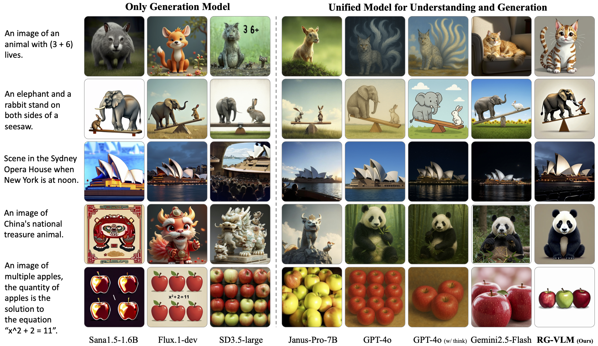
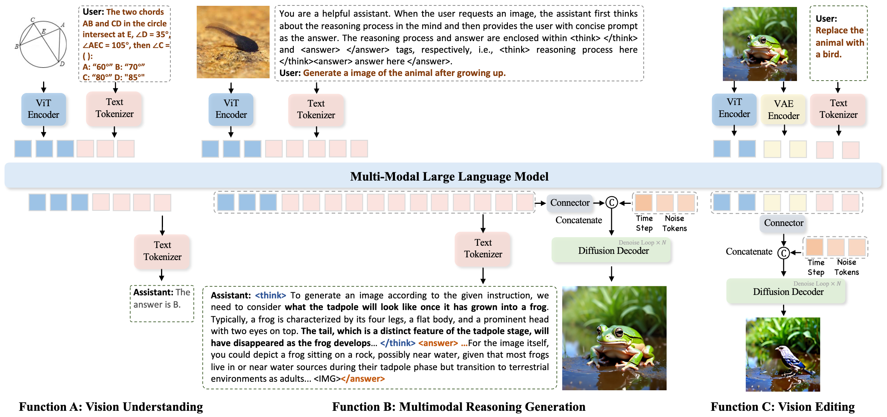
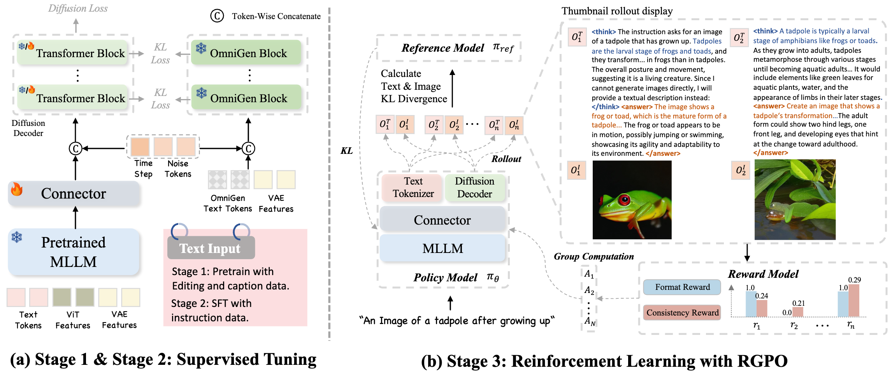
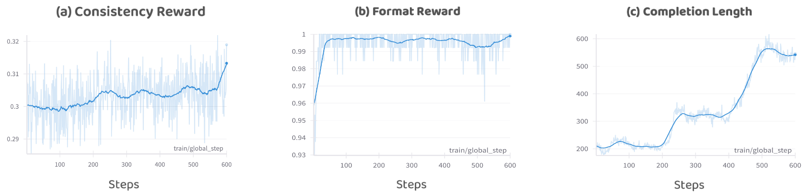

# 🤖 MindOmni: Unleashing Reasoning Generation in Vision Language Models with RGPO
[Yicheng Xiao<sup><span>1,2</span></sup>](https://easonxiao-888.github.io/), [Lin Song<sup><span>2,📧,*</span></sup>](https://linsong.info/), [Yukang Chen<sup>3</sup>](https://yukangchen.com/), [Yingmin Luo<sup><span>2</span></sup>](), [Yuxin Chen<sup><span>2</span></sup>](), [Yukang Gan<sup><span>2</span></sup>](), [Wei Huang<sup><span>4</span></sup>](https://scholar.google.com/citations?user=rZVUlPAAAAAJ&hl=zh-CN), [Xiu Li<sup><span>1,📧</span></sup>](), [Xiaojuan Qi<sup><span>4</span></sup>](https://scholar.google.com/citations?hl=en&user=bGn0uacAAAAJ&view_op=list_works&sortby=pubdate) and [Ying Shan<sup><span>2</span></sup>]()

<sup><span>*</span></sup> Project Lead  <sup><span>📧</span></sup> Corresponding author

<sup>1</sup> THU  <sup>2</sup> ARC Lab, Tencent PCG  <sup>3</sup> CUHK  <sup>4</sup> HKU

<a href="https://arxiv.org/pdf/2505.13031"></a>
<a href='https://MindOmni.github.io/'></a> 


## 📚 News
- [2025/05/19] 🔥 We release our [paper](https://arxiv.org/pdf/2406.02395)
- [2025/06/07] 🔥 The latest model after proposed RGPO tuning is publicly available on [Hugging Face](https://huggingface.co/EasonXiao-888/MindOmni).

## 📖 Abstract
Recent text-to-image systems face limitations in handling multimodal inputs and complex reasoning tasks. We introduce MindOmni, a unified multimodal large language model that addresses these challenges by incorporating reasoning generation through reinforcement learning. MindOmni leverages a three-phase training strategy: i) design of a unified vision language model with a decoder-only diffusion module, ii) supervised fine-tuning with Chain-of-Thought (CoT) instruction data, and iii) our proposed Reasoning Generation Policy Optimization (RGPO) algorithm, utilizing multimodal feedback to effectively guide policy updates. Experimental results demonstrate that MindOmni outperforms existing models, achieving impressive performance on both understanding and generation benchmarks, meanwhile showcasing advanced fine-grained reasoning generation capabilities, especially with mathematical reasoning instruction.

---

We visualize and compare advanced text-to-image methods and unified systems on the
reasoning generation task, including GPT-4o and Gemini-2.5. In the absence of a reasoning mode, GPT-4o is unable to perform reasoning generation for scenarios involving mathematical logic and physical perception.
<p align="center">
 
</p>
Figure 1: Performance Comparison on Vision Understanding Benchmarks. “Und.” and “Gen.” denote “understanding” and “generation,” respectively.

&nbsp;

**More reuslts about text2image generation and vision editing, please refer to our [project page](https://MindOmni.github.io/) or [paper](https://arxiv.org/pdf/2406.02395).**
## ⚓ Inference Framework
<p align="center">
 
</p>
Figure 2: Overview of our inference framework. MindOmni accomplishes vision understanding, multimodal reasoning generation, and vision editing tasks in a unified large model.

## ⛲ Three-stage Training Pipeline
<p align="center">
 
</p>
Figure 3: Overview of Training Pipeline. We propose a three-stage training framework comprising pretraining, instruction-based supervised fine-tuning, and reinforcement learning with RGPO.

---
## 🛠️ Experimental Results
We incorporate additional high-quality generated data from [external sources](https://github.com/JiuhaiChen/BLIP3o) and apply data cleaning and construction to further train our model and achieve higher performance.

### 🌟 Gradio Demo

    pip install -r requirements.text
    python app.py --server_name your_server_name --port your_port --model_path your_model_path

| Type | Model| MMMU | MMB | RWQA |
|:-----|:------|:---:|:---:|:---:|
|Und. only| LLaVA-OV | 48.8 | 80.8 | 66.8 |
| | Emu3-Chat | 31.6 | 58.5 | 57.4 |
| | Qwen2.5-VL | 51.1 | 83.4 | 68.9 |
|Und. and Gen.| Janus-Pro  | 41.0 | 79.2 | — |
| | TokenFlow-XL | 38.7 | 68.9 | 58.3 |
| | MetaMorph | 41.8 | 75.2 | 68.8 |
| | **MindOmni** | 51.6 | 83.2 | 68.1 |

Table 1: Performance Comparison on Vision Understanding Benchmarks. “Und.” and “Gen.” denote “understanding” and “generation,” respectively.

---

| Type | Model | Single Obj | Two Obj | Counting | Colors | Position | Color Attri | GenEval Overall |
|:-----|:---|:---:|:---:|:---:|:---:|:---:|:---:|:---:|
|Gen. Only |SDXL | 0.98 | 0.74 | 0.39 | 0.85 | 0.15 | 0.23 | 0.55 |
|      | Emu3-Gen| - | 0.81 | - | - | 0.39 | 0.45 | 0.66 |
|      | OmniGen| 0.99 | 0.86 | 0.64 | 0.85 | 0.31 | 0.55 | 0.70 |
| Und. and Gen. | Janus-Pro| 0.99 | 0.89 | 0.59 | 0.90 | 0.79 | 0.66 | 0.80 |
|      | MetaQuery-XL | - | - | - | - | - | - | 0.80† |
|      | BLIP-3o | - | - | - | - | - | - | 0.83 |
|      | **MindOmni**| 0.99 | 0.94 | 0.71 | 0.90 | 0.71 | 0.71 | 0.83 |


Table 2: Performance comparison on GenEval-Bench. “Und.” and “Gen.” denote “understanding” and “generation”, respectively. † indicates using the rewritten prompts, which may improve the accuracy significantly.

---

| Type            | Model                        |DPG Global | DPG Relation | DPG Overall |
|:-----------------|:------------------------------|:------------:|:--------------:|:-------------:|
| Gen. Only       | SDXL | 83.3       | 86.6         | 74.7        |
|                 | SimpleAR | 88.0       | 88.3         | 82.0        |
|                 | OmniGen | 87.5       | 88.3         | 81.2        |
| Und. and Gen.   | Janus-Pro | -      | -         | 84.2        |
|                 | MetaQuery-XL  | -     |  -    | 82.1        |
|                 | BLIP-3o  | -     |  -    | 80.7        |
|                 | **MindOmni** | 89.1      | 89.2         | 82.5        |


Table 3: Performance comparison on DPG-Bench. “Und.” and “Gen.” denote “understanding” and “generation”, respectively.


---

| Type           | Model   | Cultural | Time | Space | Biology | Physics | Chemistry | Overall |
|:---------------|:---------------------|:---:|:---:|:---:|:---:|:---:|:---:|:---:|
| Gen. Only      | Emu3-Gen | 0.34 | 0.45 | 0.48 | 0.41 | 0.45 | 0.27 | 0.39 |
|                | FLUX | 0.48 | 0.58 | 0.62 | 0.42 | 0.51 | 0.35 | 0.50 |
|                | OmniGen| 0.40 | 0.51 | 0.59 | 0.39 | 0.43 | 0.26 | 0.44 |
| Und. and Gen.  | Janus-Pro| 0.30 | 0.37 | 0.49 | 0.36 | 0.42 | 0.26 | 0.35 |
|                | MetaQuery-XL | 0.56 | 0.55 | 0.62 | 0.49 | 0.63 | 0.41 | 0.55 |
|                | BLIP-3o | - | - | - | - | - | - | 0.52 |
|                | **MindOmni (W/O Thinking)** | 0.40 | 0.38 | 0.62 | 0.36 | 0.52 | 0.32 | 0.43 |
|                | **MindOmni (W/ Thinking)** | 0.75 | 0.68 | 0.76 | 0.68 | 0.70 | 0.53 | 0.71 |

Table 3: Comparison with state-of-the-arts on WISE benchmark.

---

<p align="center">
 
</p>
Table 4: Curves of different Metric during RGPO in the manuscript.


## ⭐️ BibTeX
If you find this work useful for your research, please cite:
```
@article{xiao2025mindomni,
  title={MindOmni: Unleashing Reasoning Generation in Vision Language Models with RGPO},
  author={Xiao, Yicheng and Song, Lin and Chen, Yukang and Luo, Yingmin and Chen, Yuxin and Gan, Yukang and Huang, Wei and Li, Xiu and Qi, Xiaojuan and Shan, Ying},
  journal={arXiv preprint arXiv:2505.13031},
  year={2025}
}
```

## ❤️ Acknowledgement
Code in this repository is built upon several public repositories. Thanks for the wonderful work [VLM-R1](https://github.com/om-ai-lab/VLM-R1) and [OmiGen](https://github.com/VectorSpaceLab/OmniGen) ! !

## 🎤🎤🎤 Todo

- [ &#10004; ] Release the paper.
- [  &#10004; ] Release the checkpoints and inference demo.
- [ &nbsp; &nbsp; ] Release the training scripts.

<!-- ## ☑️ LICENSE
Our codes are under [MIT](https://opensource.org/license/MIT) license. -->