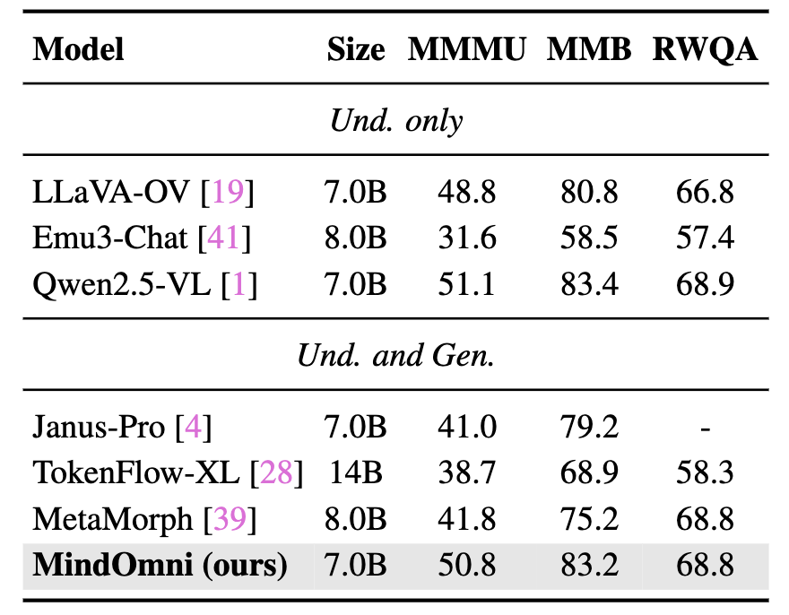
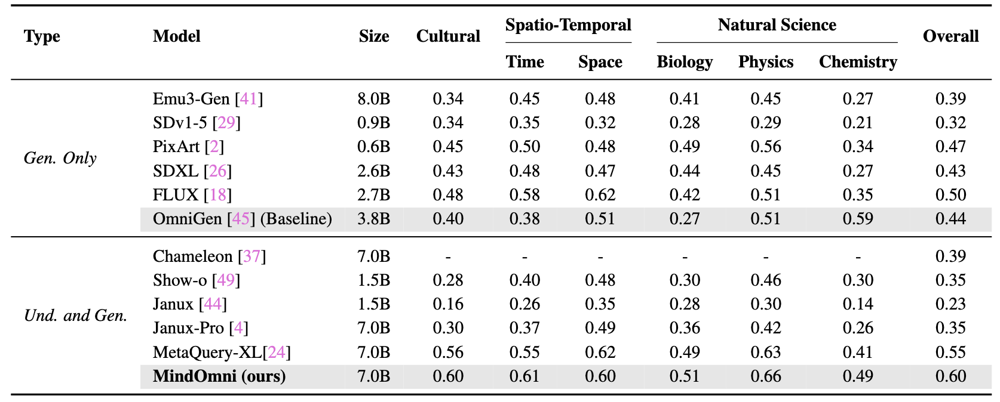

# 🤖 RG-VLM: Unleashing Reasoning Generation in Vision Language Models with RGPO
[Yicheng Xiao<sup><span>1,2</span></sup>](https://easonxiao-888.github.io/), [Lin Song<sup><span>2,📧,*</span></sup>](https://linsong.info/), [Yukang Chen<sup>3</sup>](https://yukangchen.com/), [Yingmin Luo<sup><span>2</span></sup>](), [Yuxin Chen<sup><span>2</span></sup>](), [Yukang Gan<sup><span>2</span></sup>](), [Wei Huang<sup><span>4</span></sup>](https://scholar.google.com/citations?user=rZVUlPAAAAAJ&hl=zh-CN), [Xiu Li<sup><span>1,📧</span></sup>](), [Xiaojuan Qi<sup><span>4</span></sup>](https://scholar.google.com/citations?hl=en&user=bGn0uacAAAAJ&view_op=list_works&sortby=pubdate) and [Ying Shan<sup><span>2</span></sup>]()

<sup><span>*</span></sup> Project Lead  <sup><span>📧</span></sup> Corresponding author

<sup>1</sup> THU  <sup>2</sup> ARC Lab, Tencent PCG  <sup>3</sup> CUHK  <sup>4</sup> HKU

<a href='https://arxiv.org/pdf/2406.02395'></a>
<a href='https://rg-vlm.github.io/'></a> 

## 📖 Abstract
Recent text-to-image systems face limitations in handling multimodal inputs and complex reasoning tasks. We introduce RG-VLM, a unified multimodal large language model that addresses these challenges by incorporating reasoning generation through reinforcement learning. RG-VLM leverages a three-phase training strategy: i) design of a unified vision language model with a decoder-only diffusion module, ii) supervised fine-tuning with Chain-of-Thought (CoT) instruction data, and iii) our proposed Reasoning Generation Policy Optimization (RGPO) algorithm, utilizing multimodal feedback to effectively guide policy updates. Experimental results demonstrate that RG-VLM outperforms existing models, achieving impressive performance on both understanding and generation benchmarks, meanwhile showcasing advanced fine-grained reasoning generation capabilities, especially with mathematical reasoning instruction.

---

We visualize and compare advanced text-to-image methods and unified systems on the
reasoning generation task, including GPT-4o and Gemini-2.5. In the absence of a reasoning mode, GPT-4o is unable to perform reasoning generation for scenarios involving mathematical logic and physical perception.
<p align="center">
 
</p>
Figure 1: Performance Comparison on Vision Understanding Benchmarks. “Und.” and “Gen.” denote “understanding” and “generation,” respectively.

&nbsp;

**More reuslts about text2image generation and vision editing, please refer to our [project page](https://rg-vlm.github.io/) or [paper](https://arxiv.org/pdf/2406.02395).**
## ⚓ Inference Framework
<p align="center">
 
</p>
Figure 2: Overview of our inference framework. RG-VLM accomplishes vision understanding, multimodal reasoning generation, and vision editing tasks in a unified large model.

## ⛲ Three-stage Training Pipeline
<p align="center">
 
</p>
Figure 3: Overview of Training Pipeline. We propose a three-stage training framework comprising pretraining, instruction-based supervised fine-tuning, and reinforcement learning with RGPO.

---
## 🛠️ Environment Results
<p align="center">
 
</p>
Table 1: Performance Comparison on Vision Understanding Benchmarks. “Und.” and “Gen.” denote “understanding” and “generation,” respectively.

---

<p align="center">
 
</p>
Table 2: Performance comparison on GenEval and DPG-Bench. “Und.” and “Gen.” denote “understanding” and “generation”, respectively. † indicates using the rewritten prompts, which may improve the accuracy significantly. "Size" of unified models refers to the size of the LLM backbone.

---

<p align="center">
 
</p>
Table 3: Comparison with state-of-the-arts on WISE benchmark.

---

<p align="center">
 
</p>
Table 4: Curves of different Metric in RGPO.

## 🍺 Model Zoo
Coming Soon

## ⭐️ BibTeX
If you find this work useful for your research, please cite:
```
@article{xiao2025RG-VLM,
  title={Unleashing Reasoning Generation in Vision Language Models with RGPO},
  author={Xiao, Yicheng and Song, Lin and etc.},
  year={2025}
}
```

## ❤️ Acknowledgement
Code in this repository is built upon several public repositories. Thanks for the wonderful work [VLM-R1](https://github.com/om-ai-lab/VLM-R1) and [OmiGen](https://github.com/VectorSpaceLab/OmniGen) ! !

## 🎤🎤🎤 Todo

- [ &#10004; ] Release the paper.
- [ &nbsp; &nbsp; ] Release the inference code.
- [ &nbsp; &nbsp; ] Release the config and checkpoints.

<!-- ## ☑️ LICENSE
Our codes are under [MIT](https://opensource.org/license/MIT) license. -->